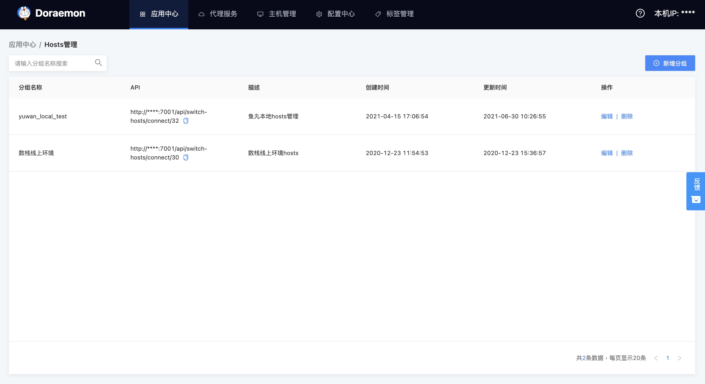
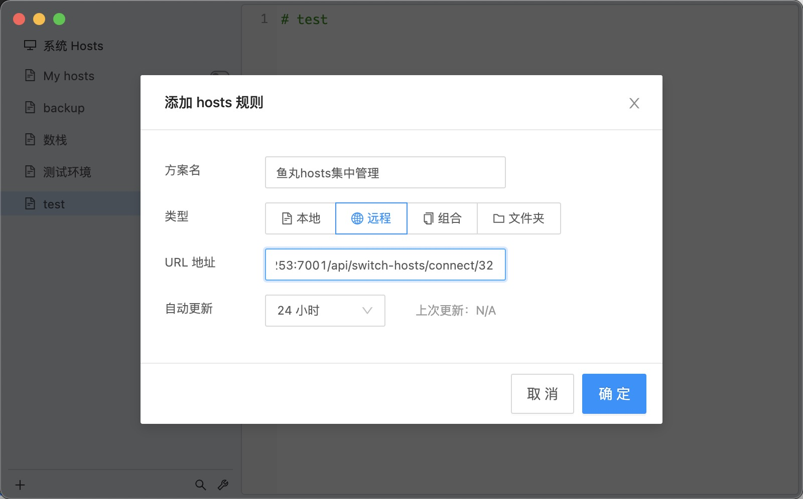

# Remote Hosts 使用指南

## 开始

Remote Hosts 是对桌面端 hosts 文件进行统一管理的 hosts 集中化管理平台，并通过远程服务端推送实时信息来更新本地 hosts 文件。

该平台支持个人使用者自定义 hosts 管理，同时支持团队使用者集中化管理成员组的 hosts 配置。

配合 SwitchHosts 使用体验更佳！

## 特性

* 配合 switchhosts 使用

* 支持自定义配置

* 支持团队集中化管理

## 快速上手

以创建一个数栈线上环境 hosts 配置为例

### 安装

如尚未安装 switchhosts, 请点击该链接（[安装地址](https://oldj.github.io/SwitchHosts/)），先进行安装

### 创建分组

填写分组名称及其描述，在编译器中填写 hosts 配置，并保存

保存后，在 hosts 管理列表中，找到刚刚创建的 hosts 分组
复制 API 进行远程连接

### 建立远程连接

在进行该步骤前，如尚未安装 switchhosts，请阅读之前的步骤，进行安装
打开 switchhosts，添加 hosts 规则
您可以选择自动更新的时间间隔

添加完成后，请耐心等待几秒
hosts 配置将会从远程同步到您本地

### 编辑分组

支持分组名称，描述编辑
支持 hosts 配置修改

### 删除分组

请注意，删除分组会影响到其他正在使用该分组的用户，请谨慎操作
