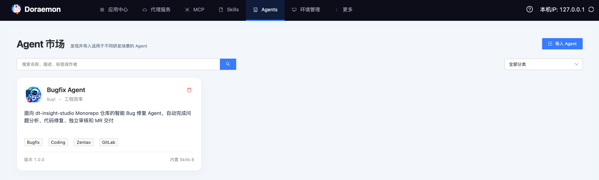
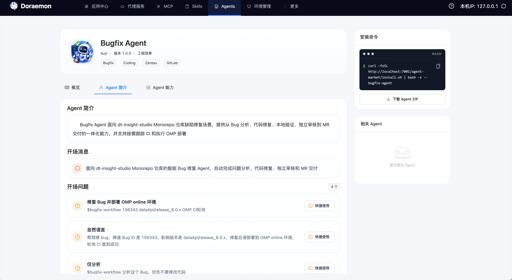
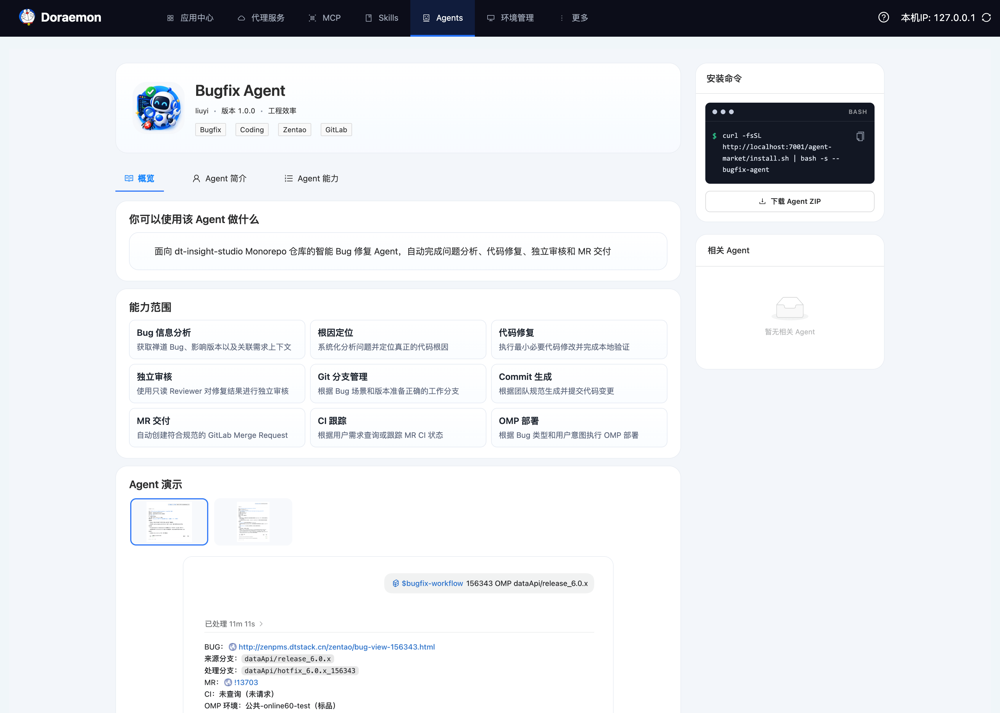
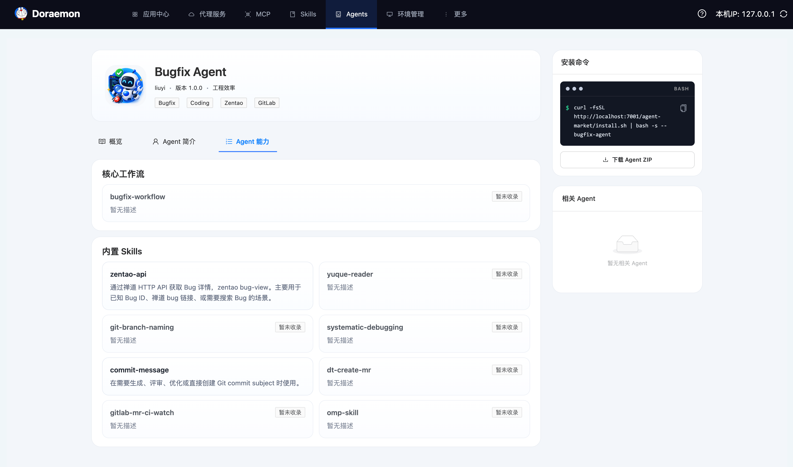

# Agent 市场

Agent 市场是 Doraemon 提供的 Agent Registry 与展示页能力，用于统一展示、导入、更新和分发 Agent 安装包。

当前版本里，Doraemon 主要负责两件事：

- Web 展示与检索：在页面中浏览 Agent 列表、查看详情、查看关联 Skill 和相关 Agent
- 安装包存储与分发：保存导入的 Agent ZIP，并提供安装命令与 ZIP 下载

需要注意：Doraemon 不负责在线运行 Agent。Agent 的实际执行仍由 Codex 等宿主环境完成。不过在 Agent 详情页中，Doraemon 现在可以通过“快捷使用”入口直接打开 Codex，并把选中的问题预填到输入框中，作为运行入口之一。

## 入口

- Agent 列表页：`/page/agents`
- Agent 详情页：`/page/agents/<agent-name>`

列表页支持：

- 按关键字搜索 Agent
- 按分类筛选
- 查看名称、简介、作者、版本、标签

详情页包含三部分信息：

- 概览：Agent 用途说明、能力范围、演示图片
- Agent 简介：详细简介、开场消息、开场问题
- Agent 能力：核心工作流和内置 Skills

## 快速使用

### 浏览和查看详情

进入 Agent 市场后，可以先在列表页按名称、描述、作者或标签搜索，再进入详情页查看完整说明。



详情页右侧会展示：

- 安装命令
- 下载 Agent ZIP
- 相关 Agent

### 复制安装命令

详情页右侧会根据当前站点地址自动拼接安装命令，格式如下：

```bash
curl -fsSL http://127.0.0.1:7001/agent-market/install.sh | bash -s -- bugfix-agent
```

其中：

- `http://127.0.0.1:7001` 会替换为当前访问 Doraemon 的站点地址
- `bugfix-agent` 是当前 Agent 的唯一名称

这条命令适合直接给使用方安装指定 Agent。

### 下载 Agent ZIP

详情页右侧支持直接下载当前 Agent 的原始 ZIP 包。

适合两个场景：

- 本地离线查看 Agent 包结构
- 参考 ZIP 目录格式，制作新的 Agent 包

如果页面提示原始 ZIP 不存在，说明这个 Agent 是历史导入数据，尚未补齐 ZIP 存档。此时重新导入一次同内容 ZIP 即可恢复下载能力。

### 直接在 Codex 中快捷使用

在 Agent 详情页的“Agent 简介 > 开场问题”区域中，每个问题右侧都提供“快捷使用”按钮。



点击后会：

- 打开 Codex 新任务
- 自动带入当前 Agent 的上下文信息
- 自动把选中的问题预填到输入框中

这个入口适合首次体验 Agent，或者直接从推荐问题开始对话。

## 详情页说明



### 你可以使用该 Agent 做什么

该区域展示 Agent 的核心用途说明，和 Agent 简介中的正文描述保持一致，便于快速理解这个 Agent 适合解决什么问题。

### 能力范围

能力范围以卡片形式展示当前 Agent 的能力项，例如：

- Bug 分析
- 代码修复
- 独立审校
- MR 交付

如果未配置能力项，页面会显示“暂无能力描述”。

### Agent 演示

演示区支持多张图片：

- 顶部显示缩略图列表
- 下方显示当前选中的完整图片
- 点击缩略图可切换展示内容

如果 Agent 未提供演示图，页面会显示“暂无演示图片”。

### Agent 简介

Agent 简介页会进一步展开 Agent 的介绍内容，包括：

- 简介正文
- 开场消息
- 开场问题

适合用于理解这个 Agent 的对话风格、首轮引导方式和使用预期。

其中“开场问题”不仅用于展示推荐提问，还支持通过“快捷使用”直接跳转到 Codex，并把问题自动填入输入框，便于从推荐问题开始使用 Agent。

### 核心工作流与内置 Skills



详情页会解析 Agent 的入口 Skill 和依赖 Skills，并分别展示为：

- 核心工作流
- 内置 Skills

如果某个 Skill 已被 Skills Hub 收录，可直接跳转到对应 Skill 详情页；如果尚未收录，会标记“暂未收录”。

### 相关 Agent

相关 Agent 不是手工配置的，而是根据依赖 Skill 的重合度自动计算出的推荐结果。当前最多展示 3 个。

如果没有可推荐的结果，会显示“暂无相关 Agent”。

## 导入与更新规则

Agent 市场当前通过上传单个 Agent ZIP 包导入数据。

ZIP 导入时会校验以下内容：

- 顶层必须且只能有一个 Agent 根目录
- 根目录下必须包含 `agent.yaml`
- `metadata.name` 必须符合命名规则
- `metadata.version` 必须是合法 SemVer
- `metadata.logo`、演示图、入口 Skill 引用必须真实存在
- Logo 仅支持 `PNG`、`JPEG`、`WebP`

### 更新规则

当上传的 Agent 名称已存在时，系统会按下面的规则处理：

- 低版本禁止覆盖高版本
- 同内容重复上传：不会重复写入数据库内容，但会补齐缺失的原始 ZIP 存档
- 不同内容更新：需要确认覆盖

### ZIP 覆盖后的存储行为

上传新 ZIP 覆盖旧版本内容后，系统会：

1. 写入新的资源文件和原始 ZIP
2. 更新数据库中的 Agent、文件快照和 Skill 关联
3. 删除旧内容哈希目录下的历史资源和历史 ZIP

也就是说，当前实现会保留当前最新的一份有效 ZIP 和资源文件，不会长期保留多份历史 ZIP。

如果更新过程失败，系统会清理这次新写入但未成功生效的目录，避免脏数据残留。

## Agent ZIP 目录约定

结合 `bugfix-agent` 的实际组织方式，一个典型的 Agent ZIP 通常会包含这些内容：

```text
bugfix-agent
├── agent.yaml
├── README.md
├── MIGRATION.md
├── setup.sh
├── assets
│   ├── logo.png
│   ├── demo1.png
│   └── demo2.png
├── skills
│   └── bugfix-workflow
│       ├── SKILL.md
│       ├── agents
│       │   └── openai.yaml
│       ├── references
│       ├── scripts
│       └── tests
└── subagents
    ├── bugfix-worker.toml
    └── bugfix-reviewer.toml
```

其中：

- `agent.yaml`：Agent 入口清单，声明页面展示字段和导入校验所需元数据
- `README.md`：Agent 使用文档
- `MIGRATION.md`：版本迁移说明
- `setup.sh`：环境准备或安装脚本
- `assets/logo.*`：Agent Logo，由 `metadata.logo` 引用
- `assets/demo*`：详情页演示图片，由 `spec.demo.images` 引用
- `skills/`：入口 Skill 及其依赖的参考文档、脚本、测试等内容
- `subagents/`：可选的子 Agent 定义，例如 Worker、Reviewer 等角色

需要注意：

- 不是所有目录都是必需的
- 当前最小必需结构仍然是“根目录 + `agent.yaml` + 被 `agent.yaml` 引用到的文件”
- `subagents/` 可以作为运行时扩展内容打包进 ZIP，但 Agent 市场第一版不会在详情页单独展示它们

## agent.yaml 要求

`agent.yaml` 是 Agent ZIP 中最重要的入口文件。当前导入时会基于它做结构校验、资源校验和详情页字段提取。

### 当前必填和校验要求

- `apiVersion` 必须是 `doraemon.dtstack.com/v1`
- `kind` 必须是 `Agent`
- `metadata.name` 必须符合命名规则
- `metadata.displayName` 不能为空
- `metadata.version` 必须是合法 SemVer
- `metadata.description` 不能为空
- `metadata.category` 必须是系统支持的分类值
- `metadata.author.name` 不能为空
- `metadata.logo` 必须存在，且文件类型仅支持 `PNG`、`JPEG`、`WebP`
- `spec.profile` 不能为空
- `spec.entrypoint.ref` 必须存在，且要能定位到入口 Skill
- `spec.demo.images[].src` 如果填写，引用文件必须存在

### 当前会被页面使用的主要字段

- `metadata.logo`：列表页和详情页 Logo
- `metadata.description`：列表简介和概览说明
- `metadata.tags`：列表和详情标签
- `spec.profile`：Agent 简介正文
- `spec.prompts`：开场问题和引导文案
- `spec.capabilities`：概览中的能力范围
- `spec.demo.images`：概览中的演示图片
- `spec.entrypoint`：Agent 能力中的核心工作流
- `spec.dependencies.skills`：内置 Skills 和相关 Agent 推荐依据

### 关于扩展字段

- 可以在 `agent.yaml` 中声明更多运行时结构
- 例如 `spec.agents` 这类子 Agent 配置，可以和 `subagents/` 目录配合使用
- 但当前 Agent 市场第一版不会把这些运行内部结构单独渲染到详情页

## 与 Skills Hub 的关系

Agent 市场和 Skills Hub 是两层不同的能力：

- Skills Hub：管理 Skill 的收录、浏览、下载和安装
- Agent 市场：管理 Agent 的展示、安装命令、原始 ZIP 和关联 Skill 说明

两者的关系可以理解为：

- Skill 是能力模块
- Agent 是把一个入口工作流和若干 Skill 组合后的可分发单元

因此在 Agent 详情页里，你会看到它依赖了哪些已收录或未收录的 Skill，但 Agent 市场本身不替代 Skills Hub。
