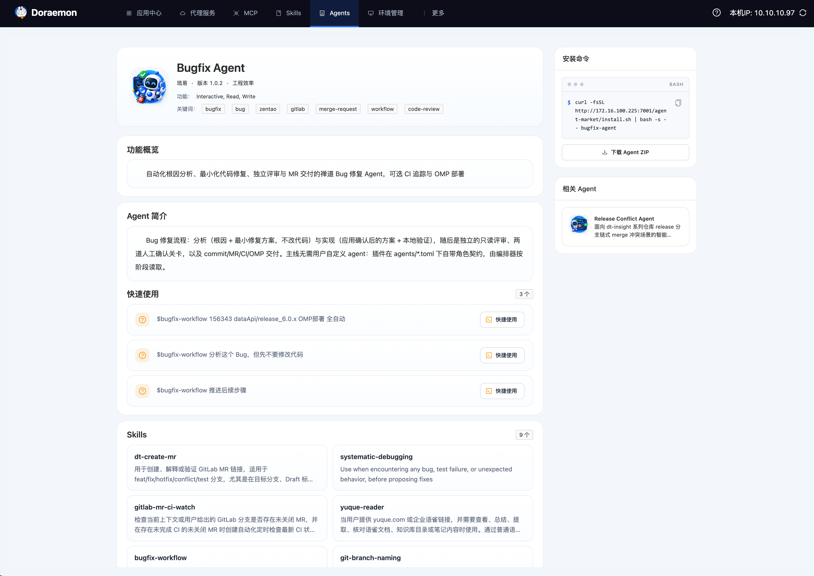

# Agent 市场

Agent 市场是 Doraemon 提供的 Agent Registry 与展示页能力，**以 Codex 与 Claude Code 双宿主原生 Plugin 的形式统一分发**和管理面向复杂研发场景的 Agent 插件包。

Doraemon 并不定义私有的 Agent 运行时协议，而是全面兼容主流 AI 编码环境（OpenAI Codex 与 Anthropic Claude Code）的官方 Plugin 规范：

- **以 Plugin 形式分发**：上架的每个 Agent 均是一个标准的双宿主 Plugin，包含了各自所需的 Manifest 清单与自包含的 Skills 依赖。
- **Web 展示与检索**：在页面中浏览 Agent 列表、查看详情、浏览关联 Skills 并获得相关 Agent 推荐。
- **安装包存储与分发**：保存导入的 Agent 插件 ZIP 包，充当企业私有 Plugin Registry，提供一键复制的终端安装命令及原始 ZIP 下载。
- **宿主快捷使用**：在 Agent 详情页中，通过“快捷使用”入口直接唤起 Codex 新会话，并把选中的开场问题和上下文预填到输入框中。

> [!NOTE]
> Doraemon 不负责在服务端在线执行 Agent。Agent 的实际运行由使用方本地的 Codex 或 Claude Code 等宿主环境完成，Doraemon 作为私有 Marketplace 负责其展示与分发。

## 入口

- Agent 列表页：`/page/agents`
- Agent 详情页：`/page/agents/<agent-name>`

### 列表页功能

列表页支持：

- 按名称、描述、作者或关键词过滤检索 Agent
- 按分类（如“工程效率”、“通用”等）筛选
- 浏览 Agent 卡片（展示 Logo、显示名称、作者、分类、简介、关键词标签及版本号）

### 详情页结构

详情页采用统一的单页纵向流式布局与侧边栏结构：

- **顶部 Hero 区域**：展示 Agent Logo、显示名称、作者、版本、分类、功能列表（逗号分隔）及关键词 Tags
- **左侧主体区域**：
  - **功能概览**：Agent 的核心用途说明
  - **Agent 简介与快速使用**：正文长描述段落，以及开场问题列表（支持一键在 Codex 中“快捷使用”）
  - **Skills 模块**：解析自包内 `skills/` 的关联技能网格卡片，展示技能名称、描述以及 Skills Hub 收录状态（收录项可点击跳转）
- **右侧边栏区域**：
  - **安装命令**：终端样式的安装脚本调用命令，支持一键复制
  - **下载 Agent ZIP**：支持直接下载当前版本的原始插件 ZIP 包
  - **相关 Agent**：基于共同技能重叠度自动计算并推荐相关 Agent

## 快速使用

### 浏览和查看详情

进入 Agent 市场后，可以先在列表页按关键字或分类检索，点击卡片进入详情页查看完整说明。


### 复制安装命令与 Plugin 分发机制

Agent 市场中的 Agent 是**以 Codex 和 Claude Code 原生 Plugin 的形式进行分发与安装的**。详情页右侧会根据当前站点地址自动生成一键安装命令：

```bash
curl -fsSL http://127.0.0.1:7001/agent-market/install.sh | bash -s -- bugfix-agent
```

#### 一键安装的底层分发逻辑

当使用者在终端执行该命令时，安装脚本 `install.sh` 会自动完成以下操作：

1. **同步本地 Marketplace 目录**：将最新的 marketplace 归档快照下载并解压至本地 `~/.agents/agent-market`。
2. **探测本地宿主 CLI**：自动探测当前环境中是否存在 `codex`（包括独立 CLI 及 macOS 桌面应用内置路径）与 `claude`（Claude Code CLI）。
3. **注册 Marketplace**：自动将本地目录注册为宿主的本地 Marketplace：
   - Codex：`codex plugin marketplace add ~/.agents/agent-market`
   - Claude Code：`claude plugin marketplace add ~/.agents/agent-market`
4. **作为 Plugin 原生安装**：
   - 在 Codex 中安装：`codex plugin add <agent-name>@agent-market`
   - 在 Claude Code 中安装：`claude plugin install <agent-name>@agent-market`
5. **执行环境预检**：运行 Agent 内部自带的 `setup.sh` 脚本，探测环境变量与基础工具依赖并输出检查结果。

#### 手动 Plugin 安装方式

由于分发产物遵循官方 Plugin 规范，除了使用上述一键安装脚本外，也可以直接使用宿主原生 Plugin 命令手动管理：

```bash
# 1. 注册本地 agent-market 源（初次使用）
codex plugin marketplace add ~/.agents/agent-market
claude plugin marketplace add ~/.agents/agent-market

# 2. 安装指定的 Agent 插件
codex plugin add bugfix-agent@agent-market
claude plugin install bugfix-agent@agent-market
```

### 插件卸载（Uninstall）

如果不再需要某个 Agent 插件，可以通过 Agent 市场提供的一键卸载脚本进行清理，也可以直接使用宿主的原生 Plugin 命令移除。

#### 一键卸载命令

卸载脚本与安装脚本位于同一静态服务路径下，执行格式如下：

```bash
curl -fsSL http://127.0.0.1:7001/agent-market/uninstall.sh | bash -s -- bugfix-agent
```

#### 一键卸载的底层行为

执行卸载脚本时，脚本会自动识别安装痕迹并完成以下清理操作：

1. **宿主插件卸载**：
   - Claude Code：自动执行 `claude plugin uninstall <agent-name>@agent-market`
   - Codex：自动执行 `codex plugin remove <agent-name>@agent-market`
2. **清理插件 Cache**：自动清理本地残余的插件缓存目录（`~/.claude/plugins/cache/agent-market/<agent-name>` 与 `~/.codex/plugins/cache/agent-market/<agent-name>`），避免遗留孤儿文件
3. **保留 Marketplace 注册**：默认保留本地 `agent-market` 源注册，以便继续使用其他 Agent

#### 手动 Plugin 卸载方式

也可以直接使用各宿主官方 CLI 进行手动卸载：

```bash
# 1. 从各宿主中卸载指定的 Agent 插件
codex plugin remove bugfix-agent@agent-market
claude plugin uninstall bugfix-agent@agent-market

# 2. （可选）若不再使用该市场源，可彻底移除 marketplace 注册
codex plugin marketplace remove agent-market
claude plugin marketplace remove agent-market
```

### 下载 Agent ZIP

详情页右侧提供“下载 Agent ZIP”按钮，支持直接下载当前 Agent 的原始插件包。

适合以下场景：

- 本地离线检查 Agent 插件包内部结构与代码
- 参考已有插件的组织方式制作新的 Agent 插件
- 离线环境下分发与手动安装

如果页面提示原始 ZIP 不存在，说明该数据为历史导入数据且尚未补齐 ZIP 存档。重新上传一次同内容 ZIP 即可恢复下载能力。

### 直接在 Codex 中快捷使用

在 Agent 详情页的“快速使用”区域中，每个开场问题右侧均提供“快捷使用”按钮。

点击后会：

1. 打开本地 Codex 并创建新任务会话
2. 自动带入当前 Agent 的上下文信息
3. 自动把选中的开场问题预填到输入框中

该入口适合首次体验 Agent，或者直接从推荐提问开始快速启动任务。

## 详情页说明



### 顶部 Hero 区域

展示 Agent 的核心标识与分类属性：

- **Logo**：展示 Agent 图标；如果未提供图片，系统会自动回退展示显示名称首字母的占位图
- **基本信息**：显示名称、作者、版本号以及所属分类
- **功能列表**：读取自配置的能力项（`capabilities`），以纯文本逗号分隔展示（如 `Interactive, Read, Write`）
- **关键词**：读取自插件的标签列表（`keywords`），以彩色 Tag 形式直观呈现（如 `bugfix`、`zentao`、`gitlab` 等）

### 功能概览

位于主体区域顶部，展示 Agent 的简短定位与用途描述（对应插件配置中的 `description`），便于使用者第一眼了解该 Agent 解决的核心问题。

### Agent 简介与快速使用

包含两部分正文：

- **Agent 简介**：展示 Agent 的详细长描述正文（对应配置中的 `interface.longDescription`），展开说明其工作流程、角色契约与交付机制
- **快速使用（开场问题）**：展示推荐的交互提问与典型触发指令（对应配置中的 `interface.defaultPrompt`，最多 3 条），每条问题均支持点击右侧“快捷使用”按钮调起 Codex

### Skills 模块

系统在导入 Agent 插件包时，会自动扫描包内 `skills/` 目录下的所有 `SKILL.md`，提取关联的技能名称与描述，并以卡片网格形式展示：

- 每个卡片展示技能名称及简要描述
- 系统会自动与 Doraemon 的 **Skills Hub** 进行比对：
  - 若已在 Skills Hub 中收录：卡片可悬浮并支持点击，将在新标签页中打开对应 Skill 的详情页
  - 若尚未收录：卡片右上角标记为 `暂未收录`

### 相关 Agent 推荐

相关 Agent 展示在右侧边栏下方，并非由人工配置，而是系统根据 Agent 之间包含的共同技能依赖重叠度进行定向查询与智能推荐（最多展示 3 个）。

点击推荐卡片可直接跳转至对应 Agent 的详情页。如果当前暂无技能重叠的 Agent，则显示“暂无相关 Agent”。

## 导入与更新规则

Agent 市场通过上传单个 Agent ZIP 插件包完成导入与版本发布。

### 导入校验规则

上传 ZIP 时，服务端会进行严格的安全与格式校验：

1. **目录层级**：ZIP 顶层必须且只能包含一个 Agent 根目录
2. **双 Manifest 齐备**：
   - 必须同时包含根目录 `.codex-plugin/plugin.json`（Codex 规范及 Doraemon 元数据来源）
   - 必须同时包含根目录 `.claude-plugin/plugin.json`（Claude Code 规范）
3. **名称与版本一致性**：
   - 两个 manifest 中的 `name` 必须一致，且必须与 ZIP 顶层根目录名完全相同
   - `name` 必须符合命名规范（由小写字母、数字和中划线组成）
   - `version` 必须是合法的 SemVer 语义化版本；若 Claude manifest 中声明了 `version`，两者必须保持一致
4. **必填元数据**：
   - `.codex-plugin/plugin.json` 中的 `description` 与 `author.name` 不能为空
   - `interface.displayName` 不能为空
5. **路径真实性**：
   - `.codex-plugin/plugin.json` 中的 `skills` 字段必须为 `./` 开头的相对路径，且对应目录在 ZIP 内必须真实存在
   - `.claude-plugin/plugin.json` 中的 `agents` 数组声明的角色文件在 ZIP 内必须真实存在
6. **开场问题限制**：
   - `interface.defaultPrompt` 最多支持 3 条，每条必须是 128 字符以内的纯文本
7. **Logo 规范**：
   - 支持通过 `interface.logo` 显式指定相对路径（如 `./assets/logo.png` 或 `./.codex-plugin/assets/logo.png`）
   - 若未显式指定，系统会自动尝试读取 `assets/logo.{png,jpg,jpeg,webp}` 或 `.codex-plugin/assets/logo.{png,jpg,jpeg,webp}`
   - 仅支持 `PNG`、`JPEG`、`WebP` 格式图片；若未提供 Logo，详情页前端将自动回退首字母占位展示

### 版本更新规则

当上传的 Agent 名称已在系统中存在时：

- **低版本禁止覆盖高版本**：系统会根据 SemVer 版本号进行校验，若上传版本低于数据库中现存版本将直接报错拒绝
- **同版本/同内容重复上传**：不会重复写入结构化数据库记录，但会自动补齐或刷新当前内容哈希对应的原始 ZIP 存档
- **新版本覆盖更新**：写入新的资源快照和原始 ZIP，更新数据库元数据与技能关联，并自动清理旧版本内容哈希目录下的历史静态资源，防止磁盘垃圾残留

## Agent ZIP 目录约定

Agent 插件包遵循统一的双宿主插件标准布局。以典型 Agent `bugfix-agent` 为例，标准的目录结构如下：

```text
bugfix-agent
├── .codex-plugin/
│   └── plugin.json                # Codex manifest 与 Doraemon 详情元数据
├── .claude-plugin/
│   └── plugin.json                # Claude Code 插件 manifest
├── assets/
│   └── logo.png                   # Agent Logo 图标（可选）
├── skills/                        # 包含的 Skills（一律随包快照分发，自包含）
│   ├── bugfix-workflow/           # 核心入口工作流 Skill
│   │   ├── SKILL.md
│   │   ├── references/
│   │   └── scripts/
│   └── zentao-api/                # 依赖的公共或基础 Skill
│       └── SKILL.md
├── agents/                        # 角色契约定义（双宿主角色）
│   ├── bugfix-worker.toml         # Codex 角色配置
│   ├── bugfix-reviewer.toml       # Codex 审校角色配置
│   └── claude/
│       ├── bugfix-worker.md       # Claude Code 角色定义
│       └── bugfix-reviewer.md     # Claude Code 审校角色定义
├── setup.sh                       # 安装前环境预检脚本（由 install.sh 调用）
├── README.md                      # Agent 使用说明
├── MIGRATION.md                   # 版本迁移与快照同步记录
└── LICENSE                        # 开源或授权协议
```

### 目录与文件职责说明

- **`.codex-plugin/plugin.json`**：插件核心清单文件，定义插件名称、版本、关联技能目录，并在 `interface` 节点中提供 Doraemon 页面展示所需的完整元数据
- **`.claude-plugin/plugin.json`**：Claude Code 规范清单，声明插件名称并在 `agents` 中列出对应的 Claude 角色定义文件
- **`skills/`**：包含 Agent 的入口工作流技能以及所依赖的所有技能。所有依赖技能一律作为快照打包进 `skills/` 随包分发，确保插件在离线或独立环境下自包含可用
- **`agents/`**：定义具体的子角色（Subagents）。包括 Codex 格式（`*.toml`）与 Claude Code 格式（`claude/*.md`）的双宿主角色契约
- **`setup.sh`**：安装前预检脚本。供 `install.sh` 在安装时执行环境探测，产出检查报告；它不是插件运行时钩子，加载插件时不会执行
- **`assets/logo.png`**：插件展示图标，推荐 256x256 尺寸的正方形图片

## Manifest 规范要求

插件包根目录下必须同时维护两份 Manifest 清单，严禁声明 `tools` 或 `model` 字段（角色能力完全通过 Skill 调用与角色契约表达）。

### 1. `.codex-plugin/plugin.json`

该文件是 Codex 插件清单，同时也是 Doraemon 解析和展示 Agent 的核心元数据来源：

```json
{
  "name": "bugfix-agent",
  "version": "1.0.2",
  "description": "自动化根因分析、最小化代码修复、独立评审与 MR 交付的禅道 Bug 修复 Agent，可选 CI 追踪与 OMP 部署",
  "author": {
    "name": "琉易"
  },
  "keywords": ["bugfix", "bug", "zentao", "gitlab", "merge-request", "workflow", "code-review"],
  "skills": "./skills/",
  "interface": {
    "displayName": "Bugfix Agent",
    "longDescription": "Bug 修复流程：分析（根因 + 最小修复方案，不改代码）与实现（应用确认后的方案 + 本地验证），随后是独立的只读评审、两道人工确认关卡，以及 commit/MR/CI/OMP 交付。主线无需用户自定义 agent：插件在 agents/*.toml 下自带角色契约，由编排器按阶段读取。",
    "developerName": "琉易",
    "category": "Coding",
    "capabilities": ["Interactive", "Read", "Write"],
    "defaultPrompt": [
      "$bugfix-workflow 156343 dataApi/release_6.0.x OMP部署 全自动",
      "$bugfix-workflow 分析这个 Bug，但先不要修改代码",
      "$bugfix-workflow 推进后续步骤"
    ],
    "logo": "./assets/logo.png"
  }
}
```

#### 主要字段说明

| 字段路径 | 类型 | 是否必填 | 说明 |
| :--- | :--- | :--- | :--- |
| `name` | string | 是 | 唯一标识，必须与 ZIP 根目录名一致 |
| `version` | string | 是 | 语义化版本号（SemVer） |
| `description` | string | 是 | 简短描述，用于列表卡片和详情页“功能概览” |
| `author.name` | string | 是 | 作者或团队名称 |
| `keywords` | string[] | 否 | 关键词标签，用于搜索过滤与顶部 Hero 标签展示 |
| `skills` | string | 是 | 技能相对路径，必须为 `./skills/` 或包含技能的相对目录 |
| `interface.displayName` | string | 是 | 详情页与列表页主标题显示名称 |
| `interface.longDescription` | string | 否 | 详情页“Agent 简介”展示的完整长描述，支持多段落 |
| `interface.category` | string | 否 | 分类标识（如 `Coding` 映射为 `工程效率`） |
| `interface.capabilities` | string[] / object[] | 否 | 能力项列表，在 Hero 区域作为功能项逗号分隔展示 |
| `interface.defaultPrompt` | string[] | 否 | 开场问题列表，最多 3 条，每条 ≤ 128 字符，提供“快捷使用”入口 |
| `interface.logo` | string | 否 | Logo 相对路径，如 `./assets/logo.png` |

### 2. `.claude-plugin/plugin.json`

该文件是 Claude Code 插件清单：

```json
{
  "name": "bugfix-agent",
  "version": "1.0.2",
  "description": "自动化根因分析、最小化代码修复、独立评审与 MR 交付的禅道 Bug 修复 Agent，可选 CI 追踪与 OMP 部署",
  "author": {
    "name": "琉易"
  },
  "agents": [
    "./agents/claude/bugfix-worker.md",
    "./agents/claude/bugfix-reviewer.md"
  ]
}
```

- `name`：必须与 `.codex-plugin/plugin.json` 的 `name` 严格保持一致
- `agents`：必须声明角色定义文件相对路径列表，引用的文件在包内必须真实存在

## 与 Skills Hub 的关系

Agent 市场与 Skills Hub 是分层互补的能力体系：

- **Skills Hub**：管理和收录原子技能（Skill），专注于单个技能的能力定义、文档、脚本及工具封装。
- **Agent 市场**：管理面向复杂业务场景的复合插件单元（Agent），将入口工作流与多个专业依赖技能有机组合，配合多角色契约形成可独立分发的工程交付单元。

在 Agent 详情页中，系统会自动列出该 Agent 内置的所有技能，并实时联动 Skills Hub 标注收录状态，实现从整体解决方案到原子技能沉淀的双向贯通。
