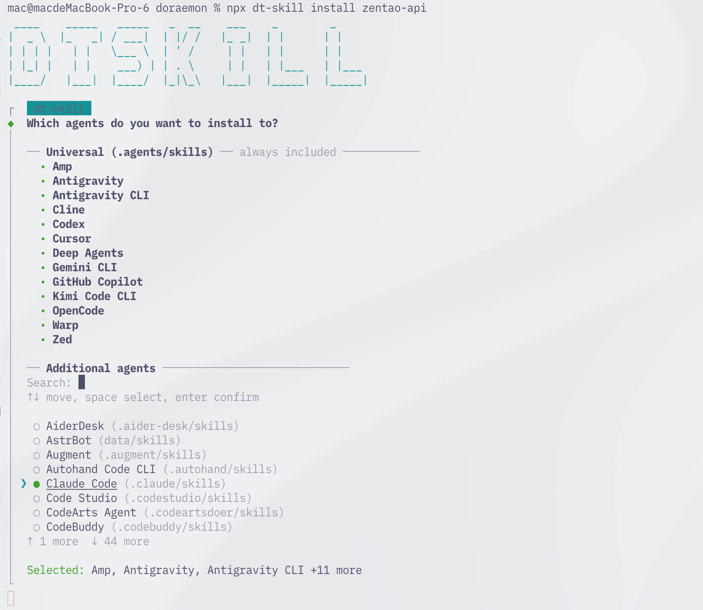
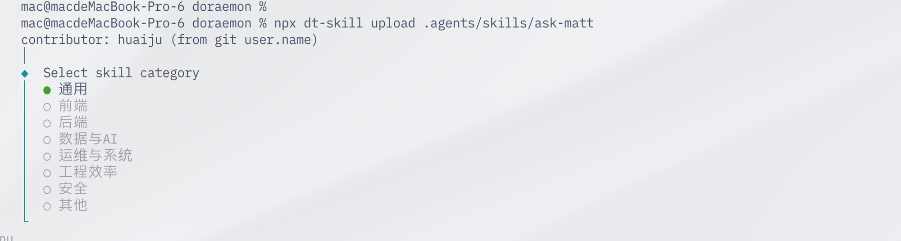

# Skills Hub（dt-skill）

Skills Hub 是 Doraemon 的 **Agent Skill 市场**能力：Web 端可浏览、下载；命令行 **`dt-skill`** 负责安装、更新、卸载本机 skill，以及把本地 skill **上传（upload）** 到 Registry。

- **Node.js 18 及以上**（与 Doraemon / `dt-skill` package `engines` 对齐，推荐 18.x）
- 默认 Registry：`http://172.16.100.225:7001`
- 更多命令与参数：`npx dt-skill -h` / `npx dt-skill <command> -h`

## 快速开始

```bash
# 无需全局安装
npx dt-skill --help

# 或全局安装
npm install -g dt-skill
```

指定 Registry（本地 Doraemon）：

```bash
export DT_SKILL_REGISTRY=http://127.0.0.1:7001
# 或
npx dt-skill --registry http://127.0.0.1:7001 list
```

| 场景 | 命令 |
|------|------|
| 安装 | `npx dt-skill install <slug>` |
| 列表 | `npx dt-skill list` |
| 更新 | `npx dt-skill update` |
| 本机卸载 | `npx dt-skill uninstall <slug>` |
| 上传发布 | `npx dt-skill upload <本地目录>` |

---

## 安装 skill（install）

从 Skill 市场安装到本机，并链接到你使用的 Agent。

```bash
npx dt-skill install zentao-api
```

安装过程中会引导选择：

* **安装到哪些 Agent**  
  - Universal（`.agents/skills`）始终包含  
  - 可搜索、多选更多 Agent（↑↓ 移动，空格选择，回车确认）

* **安装范围**  
  - Project：当前项目  
  - Global：本机全局（`~/.agents/skills`）



安装完成后，对应 Agent 即可使用该 skill。

---

## 上传 skill（upload）

开发者将本地 skill 目录发布到 Doraemon Registry，其他人即可 `install`。

```bash
npx dt-skill upload .agents/skills/ask-matt
# 与 publish 等价
npx dt-skill publish .agents/skills/ask-matt
```

常见交互：

* 自动读取 **contributor**（如 git `user.name`）
* **选择 skill 分类**（通用、前端、后端、数据与 AI、运维与系统、工程效率、安全、其他等）



同 slug 再次上传时，以**内容指纹**判断是否有实质变更。更多参数见：

```bash
npx dt-skill upload -h
```

---

## 更新 skill（update）

从 Doraemon Registry 获取最新内容并更新本机已安装 skill（按内容指纹对比，有变化再更新）。

```bash
# 交互选择更新范围：Project / Global / Both
npx dt-skill update
```

```bash
# 只更新全局
npx dt-skill update -g

# 只更新项目
npx dt-skill update -p

# 更新指定 skill
npx dt-skill update zentao-api
```

适合日常同步市场最新版。

---

## 卸载 skill（uninstall）

从本机移除已安装 skill（本地目录、lock 与 Agent 链接）。**不影响**市场上的发布。

```bash
npx dt-skill uninstall zentao-api
npx dt-skill uninstall zentao-api --yes

# 若装在全局
npx dt-skill uninstall zentao-api --global --yes
```

| 命令 | 作用 |
|------|------|
| `uninstall` | 本机删除 |
| `delete` | 市场软删（可 `undelete` 恢复），详见 `npx dt-skill delete -h` |

---

## 列表（list）

```bash
npx dt-skill list
npx dt-skill --global list
```

---

## 项目 vs 全局

| 范围 | 路径示意 | 说明 |
|------|----------|------|
| Project | `<仓库>/.agents/skills` | 跟仓库走 |
| Global | `~/.agents/skills` | 本机跨项目 |

安装可交互选择或使用 `--global`；更新可用 `-g` / `-p` 或交互三选。

---

## 更多能力

```bash
npx dt-skill -h
```

其它常用命令：`search`、`explore`、`inspect`、`pin` / `unpin`、`delete` / `undelete` 等。

## 与 Web 的关系

* **Web**（如 `http://172.16.100.225:7001/page/skills`）：浏览、搜索、详情  
* **dt-skill CLI**：工程化安装 / 更新 / 发布  

两者共用同一 Doraemon Registry。
