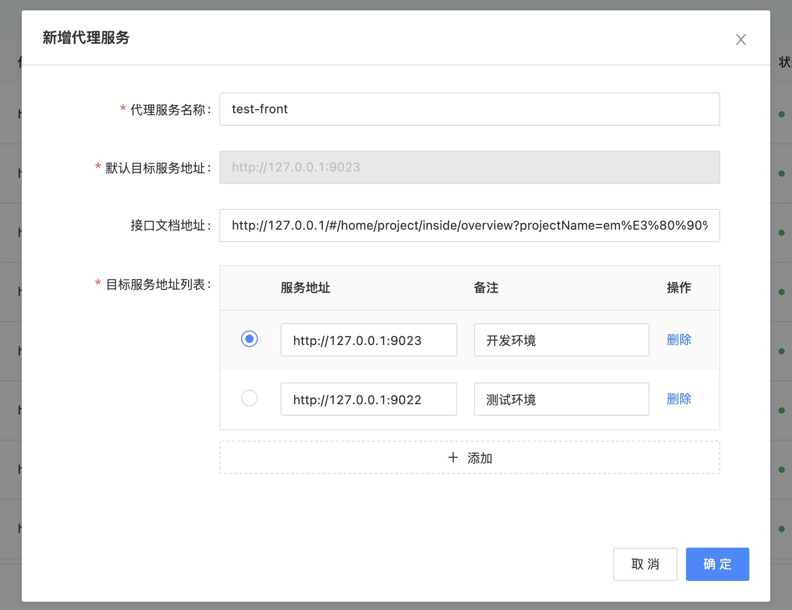
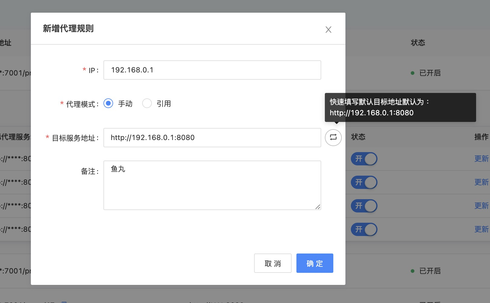
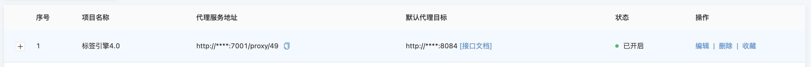
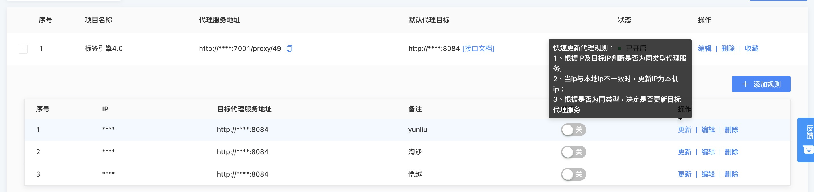
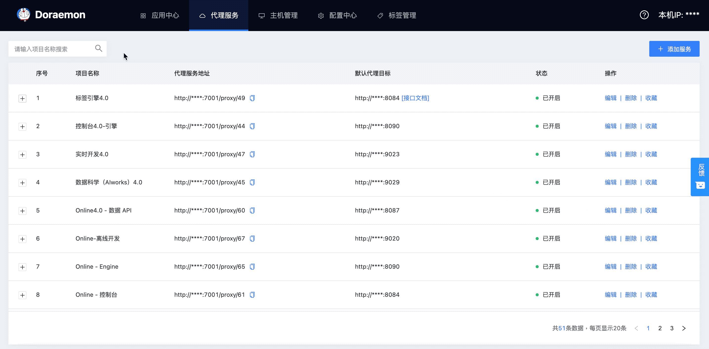

# 代理服务（Proxy）

代理服务提供项目 api 请求、服务代理的中转功能。

代理服务依赖于目标服务器、服务端 nginx 配置，使用前，需修改相关服务配置，以将服务代理托管到哆啦 A 梦代理服务平台。

注：nginx 配置修改请参考配置中心。

## 新增代理服务

新增代理服务涉及到代理服务以及代理规则

代理规则是通过 IP 作为身份标示，对应代理到你想访问的目标服务地址，该目标服务地址只对你当前机器有效。

代理规则配置可选，若未配置代理规则，默认的目标服务地址即为新增代理服务时设置的默认目标服务地址。

+ 新增代理服务

  + 支持配置接口文档地址（服务列表中可用快速访问接口文档地址）

  + 支持目标服务地址列表配置，便于在代理规则里实现快捷引入

  + 支持默认目标服务地址配置




+ 新增代理规则

  + 支持两种配置目标代理地址模式

  + 手动模式：需用户手动输入对应目标服务地址

    - 引用模式：在已有地址服务列表里选择对应地址

  + 这里留意页面右上角，那里显示的就是你的**本机 IP。**




## 如何配置使用

### 前置条件

在列表中找到刚才创建好的代理服务，复制 API




### 本地开发（前端）食用

此处以 webpack 的 devServer 为例

找到对应的 proxy ，将 target 替换为代理服务提供的 API

``` javascript
'use strict';
const ip = require('ip');
let locatIp = ip.address(); //获取请求真实ip
module.exports = {
    server: {
        port: 8080,
        host: '0.0.0.0',
        proxy: {
            '/api/v1': { // 标签引擎
                target: 'http://172.16.100.225:7001/proxy/49', // 哆啦A梦
                changeOrigin: true,
                secure: false,
                "onProxyReq":function(proxyReq, req, res) {
                    proxyReq.setHeader('X-Real-IP', locatIp)
                }
            }
        }
    }
};
```

若当前项目下未填写任何代理规则，默认的接口服务地址即为新增代理服务时设置的默认代理目标。

如果想指定自己的客户端访问服务的接口地址，点击添加一条代理规则，配置你想访问的目标代理地址。


### 服务端 Nginx 配置

```nginx
proxy_set_header   X-Real-IP  $remote_addr; # 获取客户端真实ip

# 标签引擎代理
location /api/v1  {
   proxy_pass http://doraemon/proxy/49; # doraemon
}
```

做完以上配置，项目 api 请求的接口服务就托管到了哆啦 A 梦。

访问开发环境时， 通过 nginx 反向代理，转发到哆啦 A 梦，在通过 IP 识别对应的目标代理地址，就可以代理带本地

后端同学也可通过添加代理规则，愉快的对着页面进行本地调试啦。


## 其他功能

### 更新和关闭代理服务



我们提供了，快速更新代理服务规则快捷键：

1. 根据 IP 及目标 IP 判断是否为同类型代理服务（前端，后端）

2. 当 IP 与本地 IP 不一致时，更新代理服务 IP 为本机 IP

3. 根据是否为同类型（后端），决定是否更新目标代理服务

另外的，提供代理服务状态切换功能，便于你准确的切换代理服务，减少代理规则不明确导致的服务异常。


### 常用项目收集

经常使用的项目，收藏起来，加入常用项，下次访问，点击就可以快速搜索定位到了。

