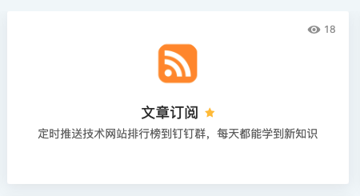
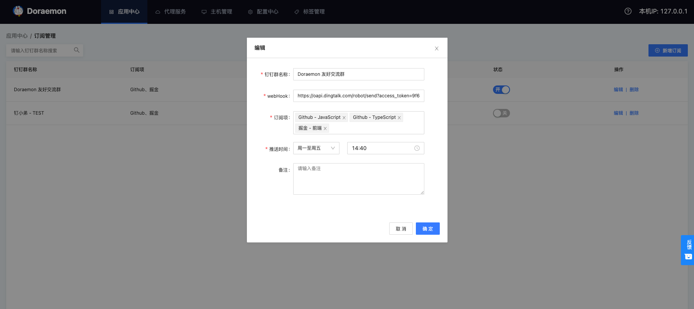
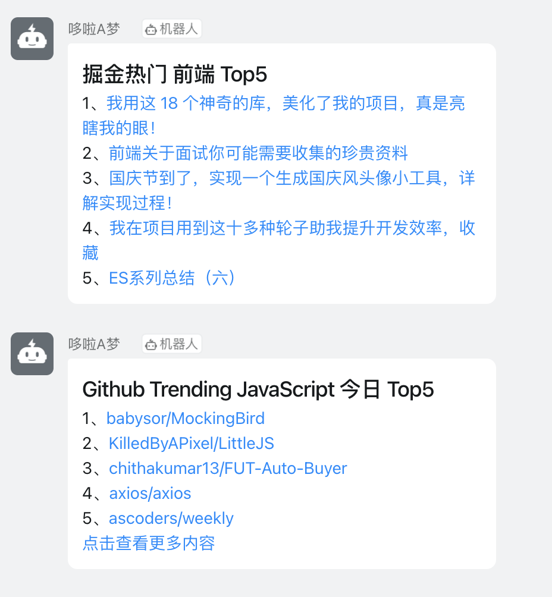

# 文章订阅

## 新增订阅

从应用中心找到“文章订阅”进入，按必填项依次输入钉钉群名称、接收订阅消息的钉钉群 webHook，选择订阅项、订阅消息发送时间（可选周一至周五或每天推送），保存后该条订阅默认处于打开状态。

>**注意**
>　　由于网络原因，Github Trending 的推送可能偶有失败。

## 关闭订阅

在订阅列表对应行，直接点击状态列修改为关闭状态即可。**请勿操作他人数据。**

## 推送消息效果

